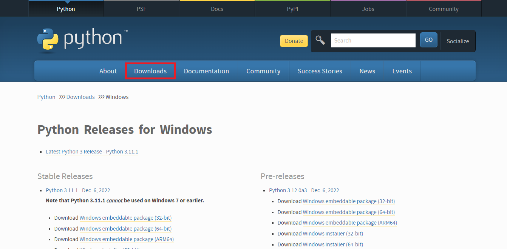
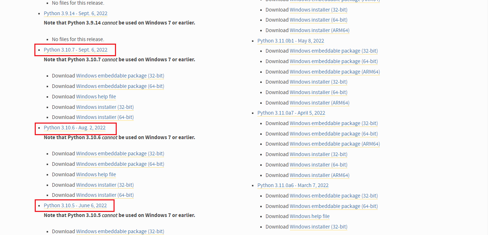
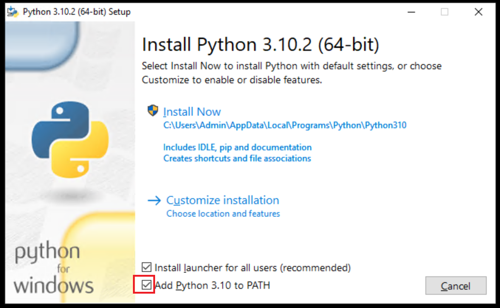

# **Python-ni kompyuterimizga o'rnatish** 

# __Birinchi bosqich__
> *Python*-ni o'zining web saytidan yuklab olamiz!
- Sayt manzili 👉 [Python.org](https://www.python.org/)

- Yuklashni boshlash uchun *Downloads* tugmasini ustiga sichqonchani yurgizamiz va kichik oyna hosil bo'ladi usha yerdan *Windows* - ni tanlaymiz!

- Rasmda ko'rsatilgan qismni toping! *E'tibor bering ayni(04.01.2023) holatiga ko'ra *Python 3.10* - versiyasi tavfsiya qilaman *3.11* - versiyasi ham mavjud lekin muammolar mavjud ushbu versiyada *vaqtincha* 

# __Ikkinchi bosqich__
> *Python*-ni o'rnatishni boshlaymiz!

- Rasmdagi belgilangan joyga ✅ belgilang!
	- *Install Now* - ni bosing!
		- O'rnatish tugashini kuting.....
			- *Close* - ni bosing o'rnatish tugatildi! 
